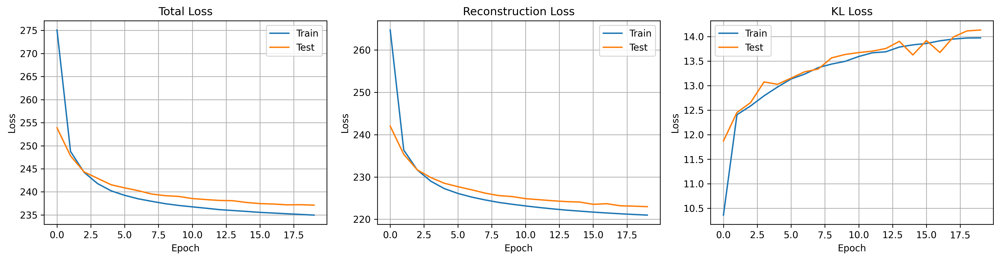
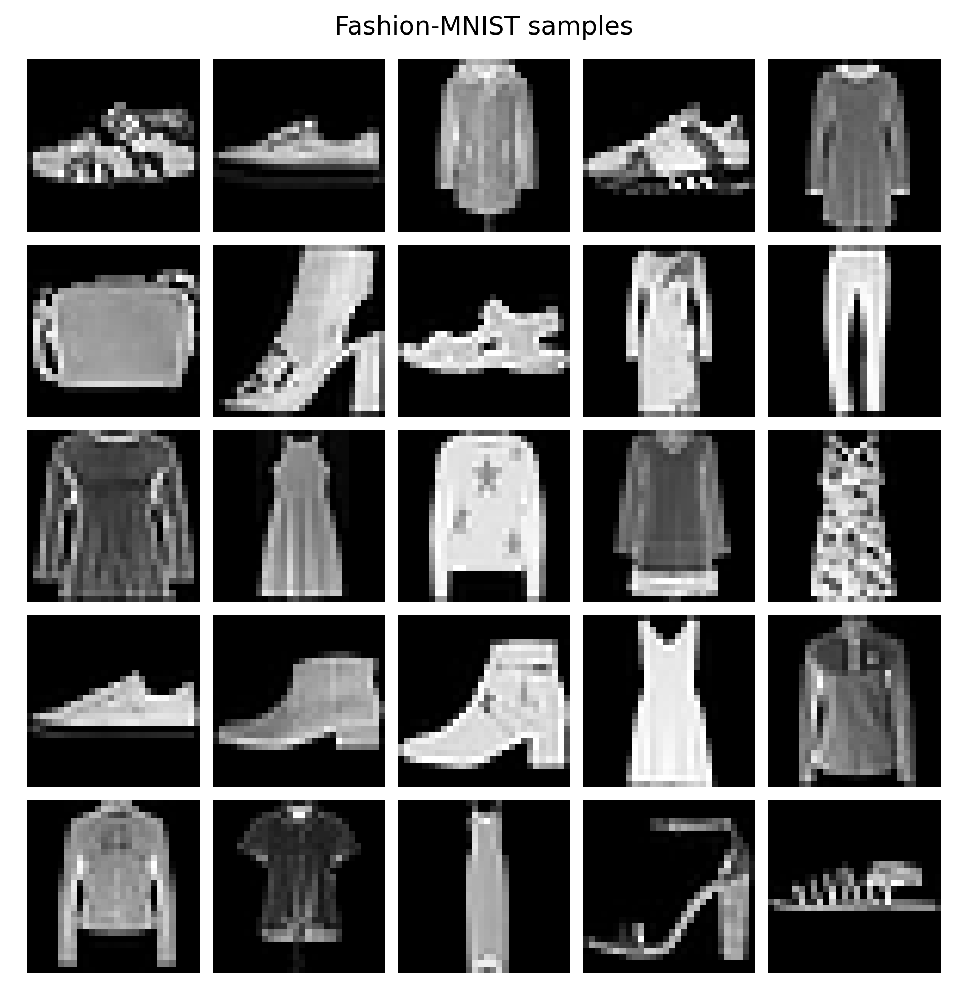
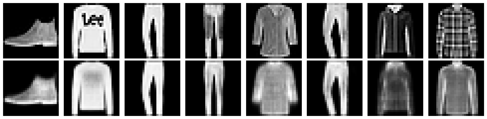
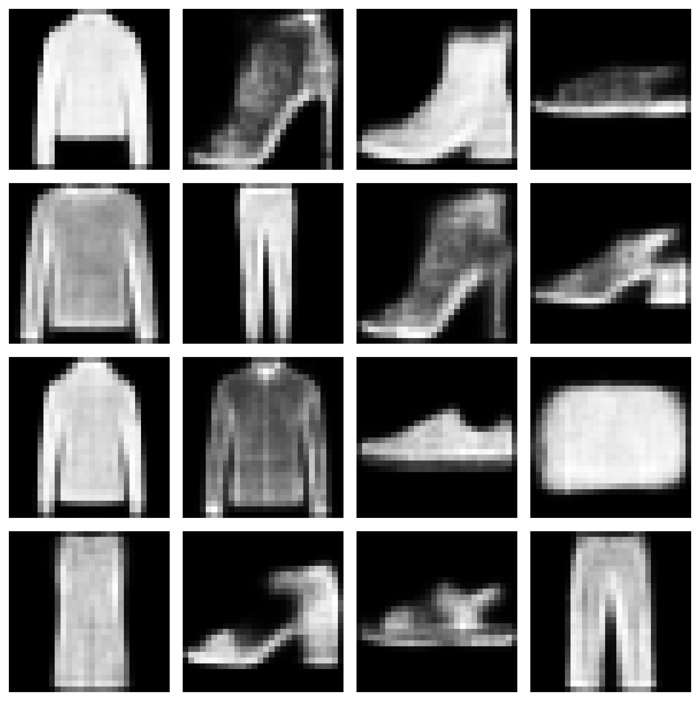
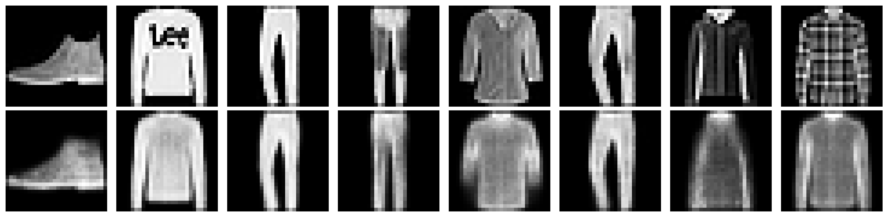
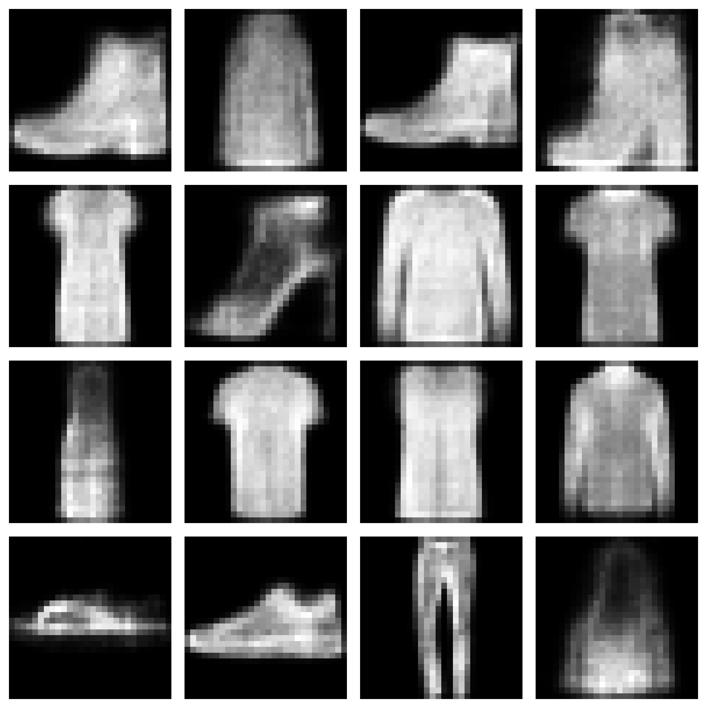

# Simplified DRAW Model for Image Generation (Fashion-MNIST)

This project implements a **simplified version of the DRAW (Deep Recurrent Attentive Writer)** model for generative image modeling using the **Fashion-MNIST dataset**.

The objective is to study how **recurrent variational autoencoders** can iteratively reconstruct and generate images while learning meaningful latent representations under limited computational resources.

---

## Project Overview

- Course: Deep Learning (M1 Artificial Intelligence – Université Paris-Saclay)  
- Student: Md Naim Hassan Saykat  
- Type: Mini Project (Research-style implementation)  

---

## Objectives

- Implement a **DRAW-inspired recurrent generative model**
- Train on a **lightweight dataset (Fashion-MNIST)** instead of the original paper dataset
- Analyze:
  - Latent representation capacity
  - KL divergence regularization (β-VAE)
- Evaluate:
  - Reconstruction quality
  - Generative capability

---

## Model Architecture

This implementation follows the core principles of the DRAW model:

- Encoder LSTM (feature extraction)
- Latent variable sampling (reparameterization trick)
- Decoder LSTM (image reconstruction)
- Iterative canvas refinement

**Simplification**:  
The original DRAW attention-based read/write mechanism is **not implemented** to reduce computational complexity.

---

## Dataset

- **Fashion-MNIST**
- 28×28 grayscale images
- 10 clothing categories
- Chosen due to:
  - Small size (fast training)
  - Suitable for generative modeling

---

## Experiments

### 1. Latent Dimension Study
- Tested: `8`, `16`, `32`
- Goal: Understand representation capacity

### 2. KL Regularization (β-VAE)
- Tested: `β = 0.5, 1.0, 2.0`
- Observed trade-off:
  - Low β → better reconstruction
  - High β → better latent structure

---

## Training Dynamics

The following plots show the evolution of:
- Total loss
- Reconstruction loss
- KL divergence



---

## Results

### Input Samples (Fashion-MNIST)


---

### Reconstructions (Model Output)
The model successfully reconstructs input images.



---

### Generated Samples (Random Sampling)
The model generates realistic samples from the latent space.



---

### Best Model Outputs

#### Reconstructions (Best β)


#### Generated Samples (Best β)


---

## Key Findings

- ✔ The model successfully learns meaningful latent representations  
- ✔ Reconstruction quality improves with larger latent dimensions  
- ✔ KL regularization introduces a trade-off between:
  - Reconstruction accuracy
  - Latent space structure  
- ✔ The model can generate coherent Fashion-MNIST images  

---

## Limitations

- No attention mechanism (unlike original DRAW)
- Limited to grayscale images
- Small dataset (no high-resolution generalization)
- Slight blur in generated outputs (expected for VAE-based models)

---

## Future Improvements

- Add **attention-based read/write mechanism**
- Train on more complex datasets (e.g., CIFAR-10)
- Use deeper architectures
- Explore diffusion-based generative models

---

## Tech Stack

- Python
- PyTorch
- NumPy
- Matplotlib

---

## Project Structure

draw-fashion-mnist-generative-model/
│
├── notebook.ipynb
├── README.md
├── images/
│   ├── fashion_mnist_samples.png
│   ├── reconstructions.png
│   ├── generated_samples.png
│   ├── best_model_reconstructions.png
│   ├── best_model_generated_samples.png
│   ├── loss_components.png
└── requirements.txt

---

## Installation

```bash
git clone https://github.com/md-naim-hassan-saykat/draw-fashion-mnist-generative-model.git
cd draw-fashion-mnist-generative-model
pip install -r requirements.txt
```

## Run the Project

```bash
jupyter notebook notebook.ipynb
```

## Notes

	- All figures are automatically saved in the images/ folder
	- The notebook is fully reproducible
	- Designed for both academic submission and portfolio showcase

## Conclusion

This project demonstrates that a simplified DRAW-style recurrent generative model can effectively:
	- Learn structured latent representations
	- Reconstruct input images
	- Generate new realistic samples

—even under constrained computational resources.

## Acknowledgment

Inspired by:

DRAW: A Recurrent Neural Network For Image Generation
Gregor et al., 2015

## Author

 **Md Naim Hassan Saykat**  
*MSc in Artificial Intelligence, Université Paris-Saclay*  

[LinkedIn](https://www.linkedin.com/in/md-naim-hassan-saykat/) |
[GitHub](https://github.com/md-naim-hassan-saykat) |
[Academic Email](mailto:md-naim-hassan.saykat@universite-paris-saclay.fr) |
[Personal Email](mailto:mdnaimhassansaykat@gmail.com) |
[Portfolio](https://md-naim-hassan-saykat.github.io)

## License

This project is licensed under the MIT License.

